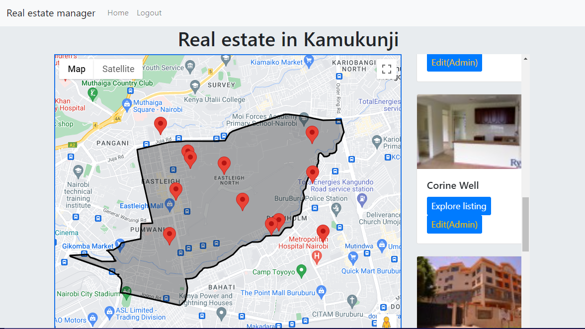
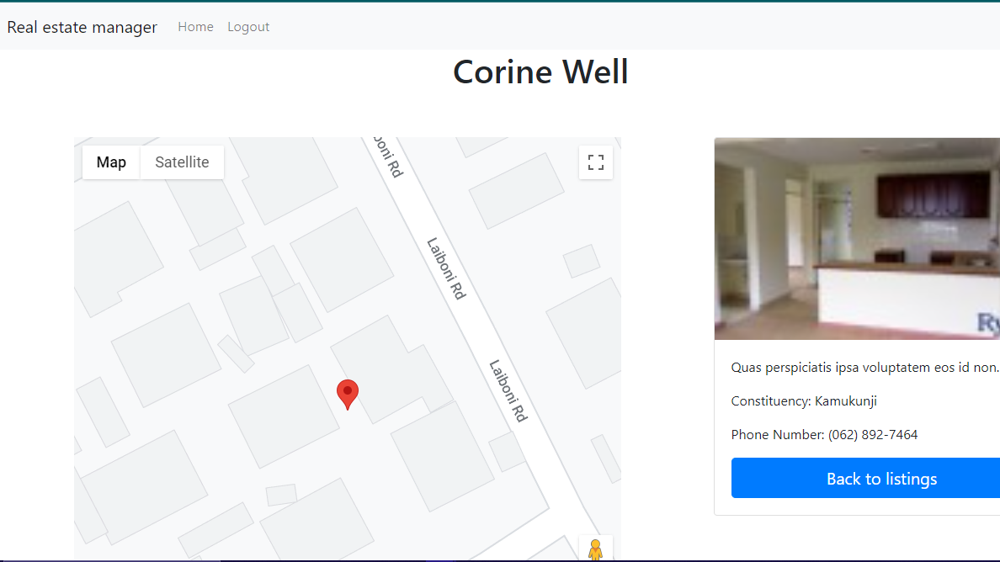
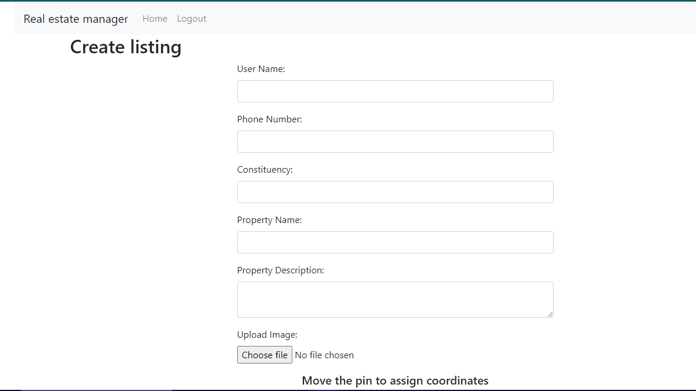
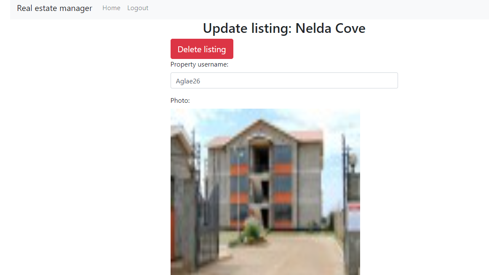
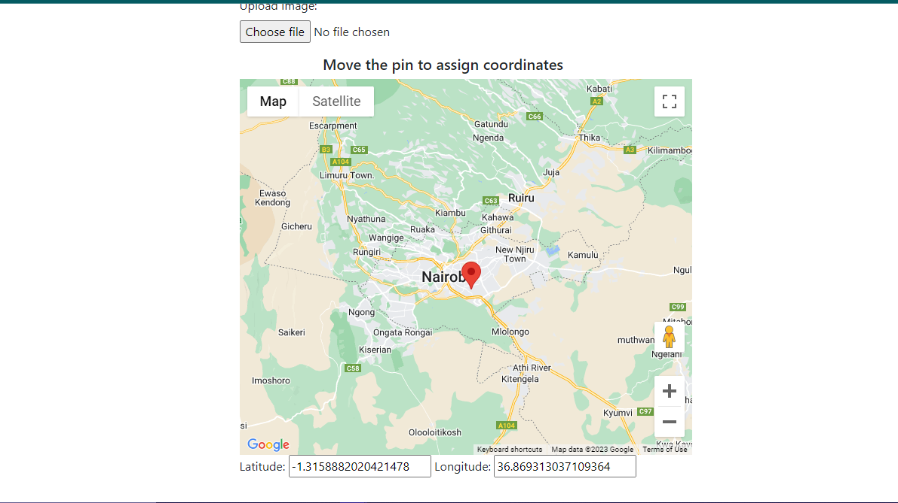

# Real Estate Manager

This repository contains the code for a Real Estate Manager application. The application allows users to manage real estate listings, including creating, updating, and deleting listings. It utilises the googlemaps api to display the marker of the location of a listing on a map view. Users can access the details of a listing by clicking on a marker.

## How It Works

The application is built using Node.js, Express.js, MongoDB, and Mongoose. It follows the Model-View-Controller (MVC) architectural pattern.

- The `index.js` file serves as the entry point for the application. It sets up the Express server, connects to the MongoDB database, and defines the routes.

- The `users.js` file contains the Mongoose schema definition for the real estate listings. It defines the real estate listing schema structure, including the name, description, longitude and latitude fields.

- The `views` folder contains the EJS templates for rendering the HTML views. The `home.ejs` file displays the list of real estate listings, the `detail.ejs` file displays the details of a listing, while the `update.ejs` file provides a form for updating a listing. 

- The `home.ejs` and `detail.ejs` ejs templates make use of the googlemaps api to display a map with markers of the coordinates of a real estate listing.

## UI elements
# Listing detail page

# Create listing

# Update listing

# Assign coordinates

## Vulnerabilities and Recommendations

It's important to consider potential vulnerabilities in the application and take necessary precautions to enhance security. Here are some recommendations:

1. **Input Validation**: Implement proper input validation and sanitization techniques to prevent security vulnerabilities such as SQL injection or cross-site scripting (XSS) attacks. Use validation libraries or frameworks to validate user inputs and sanitize data before storing or displaying it.

2. **Authentication and Authorization**: Consider implementing user authentication and authorization mechanisms to restrict access to sensitive functionality or data. This could involve implementing user login functionality, session management, and role-based access control (RBAC).

3. **Secure Database Configuration**: Ensure that the database connection details and credentials are properly protected. Avoid storing sensitive information directly in the code repository. Utilize environment variables or a secure secrets management solution to store and access the database credentials.

4. **Secure Express Middleware**: Use security-related middleware packages such as `helmet` or `express-validator` to add additional security layers to the Express application. These packages help protect against common web vulnerabilities and enhance the overall security of the application.

5. **Error Handling**: Implement appropriate error handling and logging mechanisms to catch and handle errors effectively. Avoid exposing sensitive error details to the end-users and consider logging them securely for future analysis.

Please note that this is a general overview of potential vulnerabilities and recommendations. It is important to conduct a thorough security assessment and apply industry best practices based on the specific needs of your application.

## Getting Started

To run the Real Estate Manager application locally:

1. Clone this repository to your local machine.

2. Install the required dependencies by running `npm install` in the project root directory.

3. Set up a MongoDB database and update the database connection URL in the `index.js` file.

4. Start the application by running `node index.js`.

5. Open a web browser and navigate to `http://localhost:3000` to access the application.

